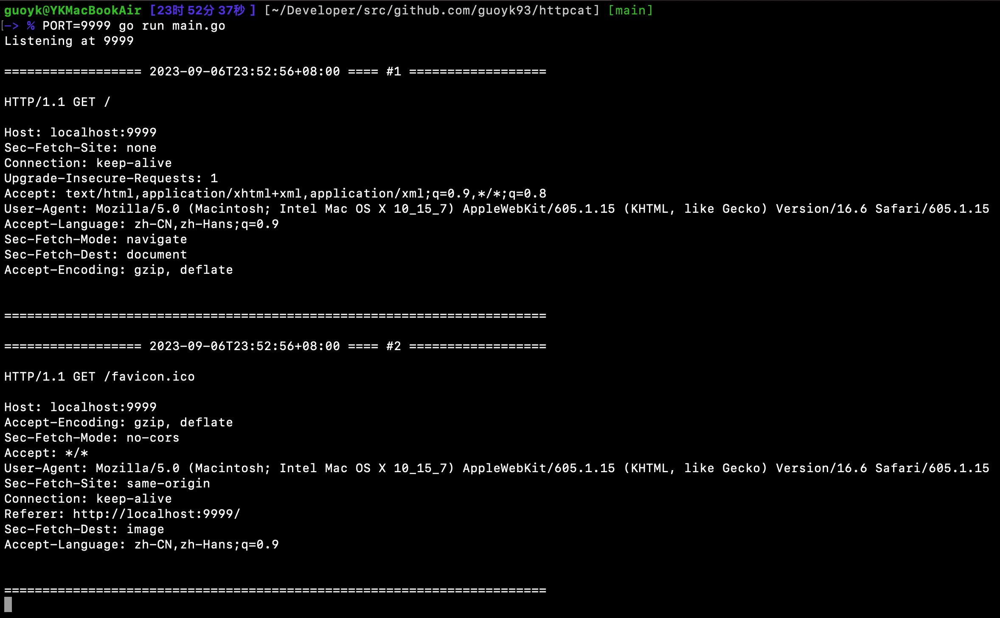

# httpcat

An HTTP debug tool that prints details of incoming HTTP requests



## Image

```
yankeguo/httpcat
ghcr.io/yankeguo/httpcat
```

## Environment Variables

- `PORT` port to listen, default to `80`
- `RESPONSE_CODE` response code, default to `200`
- `RESPONSE_TYPE` response content type, default to `text/plain; charset=utf-8`
- `RESPONSE_BODY` response body, default to `OK`

## Credits

GUO YANKE, MIT License
