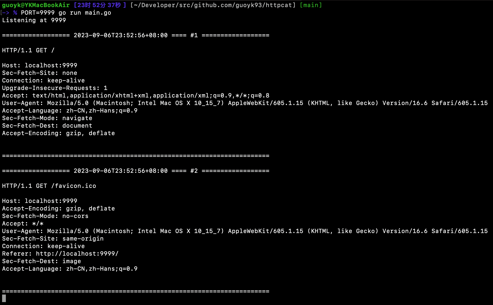

# httpcat

HTTP 调试工具，充当一个 HTTP Server 并打印所有请求的细节



## 镜像地址

```
yankeguo/httpcat
ghcr.io/yankeguo/httpcat
```

## 环境变量

- `PORT` 要监听的端口, 默认为 `80`
- `RESPONSE_CODE` HTTP 响应码, 默认为 `200`
- `RESPONSE_TYPE` HTTP 响应体类型, 默认为 `text/plain; charset=utf-8`
- `RESPONSE_BODY` HTTP 响应体, 默认为 `OK`

## 捐赠

查看 https://guoyk.net/donation

## 许可证

GUO YANKE, MIT License
